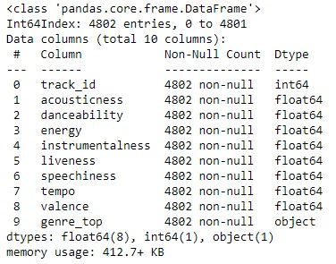
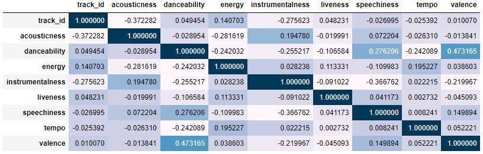
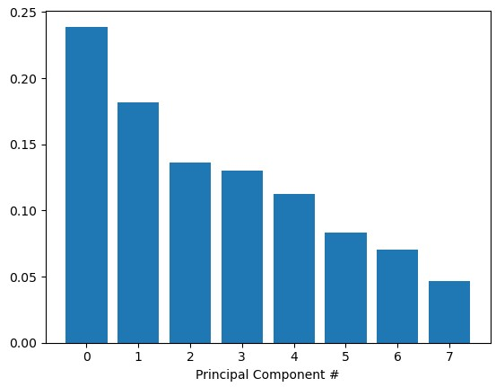
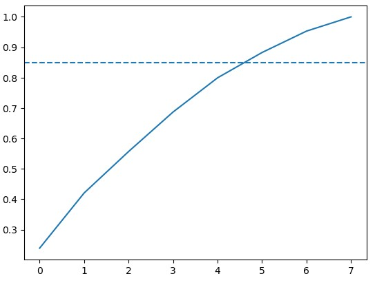
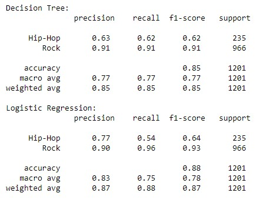
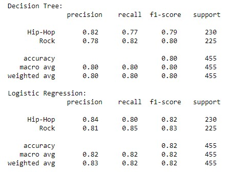

<h3 align='center'>Classify Song Genres using Audio Data<br>Rock or rap?</h3><hr>

<h3>1. Preparing our dataset</h3>
<p>    Over the past few years, streaming services with huge catalogs have become the primary means through which most people listen to their favorite music. For this reason, streaming services have looked into means of categorizing music to allow for personalized recommendations.<br><br>Let's load the metadata about our tracks alongside the track metrics compiled by <b>The Echo Nest</b>.</p>

```python
import pandas as pd

# Read in track metadata with genre labels
tracks = pd.read_csv('datasets/fma-rock-vs-hiphop.csv')

# Read in track metrics with the features
echonest_metrics = pd.read_json('datasets/echonest-metrics.json')

# Merge the relevant columns of tracks and echonest_metrics
echo_tracks = echonest_metrics.merge(tracks[['track_id', 'genre_top']], left_on='track_id', right_on = 'track_id')

# Inspect the resultant dataframe
echo_tracks.info()
```


<h3>2. Pairwise relationships between continuous variables</h3>
<p>We want to avoid using variables that have strong correlations with each other -- hence avoiding feature redundancy<br>To get a sense of whether there are any strongly correlated features in our data, we will use built-in functions in the <code>pandas</code> package <code>.corr()</code>. </p>

```python
# Create a correlation matrix
corr_metrics = echo_tracks.corr()
corr_metrics.style.background_gradient()
```
<p align='center'>
  
</p>

<h3>3. Splitting our data</h3>
<p>It can be particularly useful to simplify our models and use as few features as necessary to achieve the best result. Since we didn't find any particularly strong correlations between our features, we can now split our data into an array containing our features, and another containing the labels - the genre of the track.</p>
<p>Once we have split the data into these arrays, we will perform some preprocessing steps to optimize our model development.</p>

```python
# Import train_test_split function and Decision tree classifier
from sklearn.model_selection import train_test_split

# Create features
features = echo_tracks.drop(['track_id', 'genre_top'], axis=1).values

# Create labels
labels = echo_tracks['genre_top'].values

# Split our data
train_features, test_features, train_labels, test_labels = train_test_split(features, labels, random_state=10)
```

<h3>4. Normalizing the feature data</h3>
<p>Since we didn't find any particular strong correlations between our features, we can instead use a common approach to reduce the number of features called <b>principal component analysis (PCA)</b><br><br>Since PCA uses the absolute variance of a feature to rotate the data, a feature with a broader range of values will overpower and bias the algorithm relative to the other features. To avoid this, we must first normalize our train and test features. There are a few methods to do this, but a common way is through standardization, such that all features have a mean = 0 and standard deviation = 1</p>

```python
# Import the StandardScaler
from sklearn.preprocessing import StandardScaler  

# Scale the features and set the values to a new variable
scaler = StandardScaler()

# Scale train_features and test_features
scaled_train_features = scaler.fit_transform(train_features)
scaled_test_features = scaler.transform(test_features)
```

<h3>5. Principal Component Analysis on our scaled data</h3>
<p>Now PCA is ready to determine by how much we can reduce the dimensionality of our data. We can use <b>scree-plots</b> and <b>cumulative explained ratio plots</b> to find the number of components to use in further analyses.<br>When using scree plots, an 'elbow' (a steep drop from one data point to the next) in the plot is typically used to decide on an appropriate cutoff.</p>

```python
# This is just to make plots appear in the notebook
%matplotlib inline

# Import our plotting module, and PCA class
import matplotlib.pyplot as plt
from sklearn.decomposition import PCA 

# Get our explained variance ratios from PCA using all features
pca = PCA()
pca.fit(scaled_train_features)
exp_variance = pca.explained_variance_ratio_

# plot the explained variance using a barplot
fig, ax = plt.subplots()
ax.bar(range(pca.n_components_), exp_variance)
ax.set_xlabel('Principal Component #')
```



<p>Unfortunately, there does not appear to be a clear elbow in this scree plot, which means it is not straightforward to find the number of intrinsic dimensions using this method.</p>

<h3>6. Further visualization of PCA</h3>
<p>Let's now look at the <b>cumulative explained variance plot</b> to determine how many features are required to explain about 85% of the variance</p>

```python
# Import numpy
import numpy as np

# Calculate the cumulative explained variance
cum_exp_variance = np.cumsum(exp_variance)

# Plot the cumulative explained variance and draw a dashed line at 0.85.
fig, ax = plt.subplots()
ax.plot(cum_exp_variance)
ax.axhline(y=0.85, linestyle='--')
```


<h3>7. Projecting on to our features</h3>
<p>We saw from the plot that 6 features (indexing starts at 0) can explain 85% of the variance!<br>Therefore, we can use 6 components to perform PCA and reduce the dimensionality of our train and test features.</p>

```python
# Perform PCA with the chosen number of components and project data onto components
pca = PCA(n_components=6, random_state=10)

# Fit and transform the scaled training features using pca
train_pca = pca.fit_transform(scaled_train_features)

# Fit and transform the scaled test features using pca
test_pca = pca.transform(scaled_test_features)
```

<h3>8. Train a decision tree to classify genre</h3>
<p>Now we can use the lower dimensional PCA projection of the data to classify songs into genres. we will be using a simple algorithm known as a <b>decision tree</b>.</p>

```python
# Import Decision tree classifier
from sklearn.tree import DecisionTreeClassifier


# Train our decision tree
tree = DecisionTreeClassifier(random_state=10)
tree.fit(train_pca, train_labels)

# Predict the labels for the test data
pred_labels_tree = tree.predict(test_pca)
```

<h3>9. Compare our decision tree to a logistic regression</h3>
<p>There's always the possibility of other models that will perform even better! Sometimes simplest is best, and so we will start by applying <b>logistic regression</b>.</p>


```python
# Import LogisticRegression
from sklearn.linear_model import LogisticRegression

# Train our logistic regression and predict labels for the test set
logreg = LogisticRegression(random_state=10)
logreg.fit(train_pca, train_labels)
pred_labels_logit = logreg.predict(test_pca)

# Create the classification report for both models
from sklearn.metrics import classification_report
class_rep_tree = classification_report(test_labels, pred_labels_tree)
class_rep_log = classification_report(test_labels, pred_labels_logit)

print("Decision Tree: \n", class_rep_tree)
print("Logistic Regression: \n", class_rep_log)
```


<h3>10. Balance our data for greater performance</h3>
<p>Both our models do similarly well, boasting an average precision of 85% and 87%. However, looking at our classification report, we can see that rock songs are fairly well classified, but hip-hop songs are disproportionately misclassified as rock songs.<br><br>This is because we have far more data points for the rock classification than for hip-hop, potentially skewing our model's ability to distinguish between classes. This also tells us that most of our model's accuracy is driven by its ability to classify just rock songs, which is not ideal.<br><br>To account for this, we can weight the value of a correct classification in each class inversely to the occurrence of data points for each class. Since a correct classification for "Rock" is not more important than a correct classification for "Hip-Hop" (and vice versa), we only need to account for differences in sample size of our data points when weighting our classes here, and not relative importance of each class.</p>

```python
# Subset a balanced proportion of data points
hop_only = echo_tracks.loc[echo_tracks['genre_top'] == 'Hip-Hop']
rock_only = echo_tracks.loc[echo_tracks['genre_top'] == 'Rock']

# subset only the rock songs, and take a sample the same size as there are hip-hop songs
rock_only = rock_only.sample(hop_only.shape[0], random_state=10)

# concatenate the dataframes hop_only and rock_only
rock_hop_bal = pd.concat([rock_only, hop_only])

# The features, labels, and pca projection are created for the balanced dataframe
features = rock_hop_bal.drop(['genre_top', 'track_id'], axis=1) 
labels = rock_hop_bal['genre_top']

# Redefine the train and test set with the pca_projection from the balanced data
train_features, test_features, train_labels, test_labels = train_test_split(
    features, labels, random_state=10)

train_pca = pca.fit_transform(scaler.fit_transform(train_features))
test_pca = pca.transform(scaler.transform(test_features))
```

<h3>11. Does balancing our dataset improve model bias?</h3>
<p>Let's test to see if balancing our data improves model bias towards the "Rock" classification while retaining overall classification performance</p>

```python
# Train our decision tree on the balanced data
tree = DecisionTreeClassifier(random_state=10)
tree.fit(train_pca, train_labels)
pred_labels_tree = tree.predict(test_pca)

# Train our logistic regression on the balanced data
logreg = LogisticRegression(random_state=10)
logreg.fit(train_pca, train_labels)
pred_labels_logit = logreg.predict(test_pca)

# Compare the models
print("Decision Tree: \n", classification_report(test_labels, pred_labels_tree))
print("Logistic Regression: \n", classification_report(test_labels, pred_labels_logit))
```



<h3>12. Using cross-validation to evaluate our models?</h3>
<p>Balancing our data has removed bias towards the more prevalent class. To get a good sense of how well our models are actually performing, we can apply what's called <b>cross-validation<b> (CV). This step allows us to compare models in a more rigorous fashion</p>

```python
from sklearn.model_selection import KFold, cross_val_score
from sklearn.pipeline import Pipeline
tree_pipe = Pipeline([("scaler", StandardScaler()), ("pca", PCA(n_components=6)), 
                      ("tree", DecisionTreeClassifier(random_state=10))])
logreg_pipe = Pipeline([("scaler", StandardScaler()), ("pca", PCA(n_components=6)), 
                        ("logreg", LogisticRegression(random_state=10))])

# Set up our K-fold cross-validation
kf = KFold(10)

# Train our models using KFold cv
tree_score = cross_val_score(tree_pipe, features, labels, cv=kf)
logit_score = cross_val_score(logreg_pipe, features, labels, cv=kf)

# Print the mean of each array of scores
print("Decision Tree:", np.mean(tree_score))
>>> Decision Tree: 0.7582417582417582
print("Logistic Regression:", np.mean(logit_score))
>>> Logistic Regression: 0.782967032967033
```

<h4> Success! </h4>
